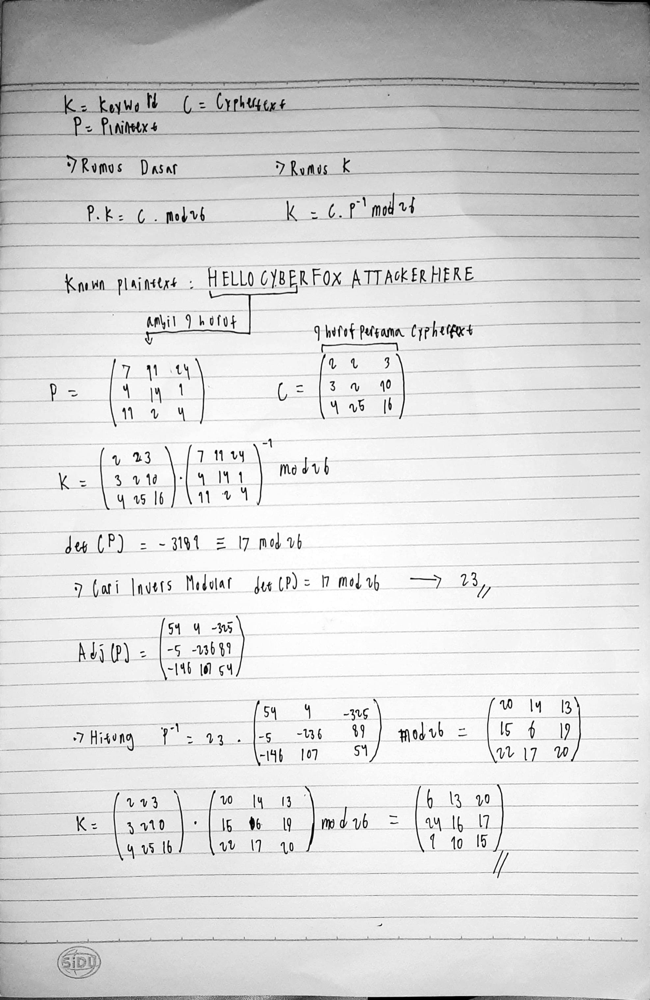

# Hill Cipher Kriptanalisis

# Hill Cipher

**Aryasatya Alaauddin** 

**5027231082**
**Waktu Cryptanalisis:**
6 jam

**Known plaintext:**

> "Hello Cyber Fox, attacker here!"
> 

**Ciphertext:**

> “CDECCZDKQFYRYRWYWXKVTSBQABTRVRITRXVVKWKJKEMUEVKLYUPUAFSPPSFSKZVGJKKNLWNFXSMUDVHKSWMFERVUWEVZTZQVOGWALCAYTKXAKNKYDTZMTWATADALYSANZSBMIGPUGNTMHFJRSKSTLQKFRXAKHMOHEYQDUMSFIAMOBSKBFWZKGZEVAKSHQHPGJUKKLNSZAIFCWUKUKWMMJUDVVOWHWXEAVWODIAMOBSDNNNUYYRVRWMPQPYJDZRXDZBJUKOPUXIZQTHSKKHEYATYCONMHOACPMNIESNKZZYBKTZHXCGOABREJCIDCJCRVRWNFCJPCUWYNQGCGSLJDWLCHBWNFLCMGNNTDLMPTLSYFWAUMGWFMWQCCWPLAMTSZXAULWDEADALPBQIDUTSJGSWPGKBIAMOBSOKSPGFBDDLMECGVUDVEEZYCORCJEIOMXENEQUMGZHUUSOSCNSFSMDPALWXAHIDEWNFJOQJLLELRNAUVOQQDUINZIKVMSSSGOMGRHSKZWJVOQASVCKVIZGIQWPIQGJKLWURYLIQBOAZMHOACPMNIESNCUKXWSGIYEBHTYIBEIMHOACPMNIESNSKKHEYOOPTSOFRFHSGBZHXCXATDOOFNOEWKQXHJYCUYUZBPXSMDESDJDOZGANUGMFWSMMLMCYZEVECXLFNUACWPYMHOBSWQCQWROHPVUMDOTEMXBGDANZKNUCSLFSKPCJUGAURCOQZOUEXTFWNFETPUPLZMTAVZQOZCJCRVRWNFYILHSXUSQBXBNSIFSFCWPHAVOHVWCRTNPIWQWLYTEEEQXEMXBUPCAFBXBPGMPGVTFDTDLNGOCPMPUYXHWVZNMVDMZGOZDGQHSGWAQXLZGPGSYUZAPVSBQBXBPGMPGVTFDVGGAWQOPAAVZDSSNLJANNSETBGXSSBFCJDWLCHBWNFMULCJCRVRNWJIUIFFVBVLHYCKKSTRZPQICAQUUPEKMEYLECLAHACASRIADDUVDHIQWZAIORLZMCAIEOMJNGONEDVCCOGXQMPXHJYCUYUZJOQDTJMXFWQCEQXQJOMJPOJIABTRVRPUYEDSDDHSUOFIUTQJFESFWGATDZQVZVHBHZAPVSBQCBOXUNFQGZZPKSQQDUWUTGYNXLXFYEVZAYRFLAMDUNZUMPVDZZDMETGIVHMDNHXAXPLLNCAYNSVDNAXSMVVLYDTCRPLRFLAMTSZXAULWDHCVAKKOHPVUMKJOSQGQBWYKLKRQSKKMMJLWWWTCYKEUGNWBGKNLWUTRYYYBLOIDNWREQXACLBEVUDVDECEQXMFWFRFUMONGIENMOEY”
> 

## Langkah-langkah pemecahan (Known Plaintext Attack)

### 1. Menemukan Matriks Kunci



```python
# Matriks Kunci
K = [
        [6, 13, 20],
        [24, 16, 17],
        [1, 10, 15]
    ]
```

Setelah menemukan matriks kuncinya, mari kita uji coba dengan script dekripsi menggunakan python.

### 2. Dekripsi menggunakan script python

```python
import numpy as np
import string

def mod_inverse(a, m):
    """Menghitung modular inverse dari a modulo m.
       Mengembalikan x sehingga (a*x) % m == 1, jika ada.
    """
    a = a % m
    for x in range(1, m):
        if (a * x) % m == 1:
            return x
    raise ValueError(f"Tidak ada modular inverse untuk {a} modulo {m}")

def matrix_mod_inv(matrix, modulus):
    """Menghitung invers dari matriks 3x3 modulo modulus."""
    det = int(round(np.linalg.det(matrix)))  # hitung determinan asli
    det = det % modulus
    inv_det = mod_inverse(det, modulus)
    
    # Hitung matriks kofaktor
    cof = np.zeros((3,3), dtype=int)
    for i in range(3):
        for j in range(3):
            # Mengambil minor dari elemen (i, j)
            minor = np.delete(np.delete(matrix, i, axis=0), j, axis=1)
            cof[i][j] = ((-1)**(i+j)) * int(round(np.linalg.det(minor)))
    
    # Matriks adjugate adalah transpose dari kofaktor
    adjugate = cof.T
    inv_matrix = (inv_det * adjugate) % modulus
    return inv_matrix

def text_to_numbers(text):
    """Mengubah teks (A-Z) menjadi list angka 0-25."""
    return [string.ascii_uppercase.index(char) for char in text]

def numbers_to_text(numbers):
    """Mengubah list angka 0-25 menjadi teks (A-Z)."""
    return ''.join([string.ascii_uppercase[num % 26] for num in numbers])

def decrypt_hill(ciphertext, key_matrix):
    modulus = 26
    key_matrix = np.array(key_matrix)
    if key_matrix.shape != (3,3):
        raise ValueError("Key matrix harus berukuran 3x3")
    
    inv_key = matrix_mod_inv(key_matrix, modulus)
    
    # Pastikan panjang ciphertext adalah kelipatan 3
    if len(ciphertext) % 3 != 0:
        raise ValueError("Panjang ciphertext harus kelipatan 3")
    
    plaintext = ""
    # Proses setiap blok 3 huruf
    for i in range(0, len(ciphertext), 3):
        block = ciphertext[i:i+3]
        block_nums = np.array(text_to_numbers(block)).reshape(3, 1)
        decrypted_nums = np.dot(inv_key, block_nums) % modulus
        decrypted_block = numbers_to_text(decrypted_nums.flatten().tolist())
        plaintext += decrypted_block
    return plaintext

if __name__ == "__main__":
    # Key matriks 3x3 sesuai permintaan:
    key = [
        [6, 13, 20],
        [24, 16, 17],
        [1, 10, 15]
    ]
    
    # Ciphertext yang diberikan (pastikan hanya huruf kapital tanpa spasi)
    ciphertext = ("CDECCZDKQFYRYRWYWXKVTSBQABTRVRITRXVVKWKJKEMUEVKLYUPUAFSPPSFSKZVGJKKNLWNFXSMUDVHKSWMFERVUWEVZTZQVOGWALCAYTKXAKNKYDTZMTWATADALYSANZSBMIGPUGNTMHFJRSKSTLQKFRXAKHMOHEYQDUMSFIAMOBSKBFWZKGZEVAKSHQHPGJUKKLNSZAIFCWUKUKWMMJUDVVOWHWXEAVWODIAMOBSDNNNUYYRVRWMPQPYJDZRXDZBJUKOPUXIZQTHSKKHEYATYCONMHOACPMNIESNKZZYBKTZHXCGOABREJCIDCJCRVRWNFCJPCUWYNQGCGSLJDWLCHBWNFLCMGNNTDLMPTLSYFWAUMGWFMWQCCWPLAMTSZXAULWDEADALPBQIDUTSJGSWPGKBIAMOBSOKSPGFBDDLMECGVUDVEEZYCORCJEIOMXENEQUMGZHUUSOSCNSFSMDPALWXAHIDEWNFJOQJLLELRNAUVOQQDUINZIKVMSSSGOMGRHSKZWJVOQASVCKVIZGIQWPIQGJKLWURYLIQBOAZMHOACPMNIESNCUKXWSGIYEBHTYIBEIMHOACPMNIESNSKKHEYOOPTSOFRFHSGBZHXCXATDOOFNOEWKQXHJYCUYUZBPXSMDESDJDOZGANUGMFWSMMLMCYZEVECXLFNUACWPYMHOBSWQCQWROHPVUMDOTEMXBGDANZKNUCSLFSKPCJUGAURCOQZOUEXTFWNFETPUPLZMTAVZQOZCJCRVRWNFYILHSXUSQBXBNSIFSFCWPHAVOHVWCRTNPIWQWLYTEEEQXEMXBUPCAFBXBPGMPGVTFDTDLNGOCPMPUYXHWVZNMVDMZGOZDGQHSGWAQXLZGPGSYUZAPVSBQBXBPGMPGVTFDVGGAWQOPAAVZDSSNLJANNSETBGXSSBFCJ")
    ciphertext += ("DWLCHBWNFMULCJCRVRNWJIUIFFVBVLHYCKKSTRZPQICAQUUPEKMEYLECLAHACASRIADDUVDHIQWZAIORLZMCAIEOMJNGONEDVCCOGXQMPXHJYCUYUZJOQDTJMXFWQCEQXQJOMJPOJIABTRVRPUYEDSDDHSUOFIUTQJFESFWGATDZQVZVHBHZAPVSBQCBOXUNFQGZZPKSQQDUWUTGYNXLXFYEVZAYRFLAMDUNZUMPVDZZDMETGIVHMDNHXAXPLLNCAYNSVDNAXSMVVLYDTCRPLRFLAMTSZXAULWDHCVAKKOHPVUMKJOSQGQBWYKLKRQSKKMMJLWWWTCYKEUGNWBGKNLWUTRYYYBLOIDNWREQXACLBEVUDVDECEQXMFWFRFUMONGIENMOEY")
    
    try:
        hasil = decrypt_hill(ciphertext, key)
        print("Plaintext:", hasil)
    except Exception as e:
        print("Terjadi kesalahan:", e)

```

**Output:**

HELLOCYBERFOXATTACKERHERECRYPTOGRAPHYISCRUCIALFORSAFEGUARDINGINFORMATIONINCOMPUTINGSYSTEMSANDPLAYSANINTEGRALROLEINTHEDAILYLIVESOFBILLIONSOFPEOPLEWORLDWIDEBYENSURINGTHESECURITYOFBOTHSTOREDANDTRANSMITTEDDATAASACORECOMPONENTOFMANYSECURITYPROTOCOLSPARTICULARLYTRANSPORTLAYERSECURITYTLSCRYPTOGRAPHICMETHODSPROVIDESTRONGENCRYPTIONACROSSVARIOUSAPPLICATIONSHOWEVERDESPITEITSSIGNIFICANCECRYPTOGRAPHYREMAINSVULNERABLEITSSECURITYCANBEENTIRELYCOMPROMISEDBYASINGLEDESIGNFLAWORCODINGERRORTRADITIONALSOFTWARETESTINGTECHNIQUESSUCHASUNITTESTINGAREINADEQUATEFORIDENTIFYINGCRYPTOGRAPHICWEAKNESSESINSTEADCRYPTOGRAPHICSECURITYISREINFORCEDTHROUGHRIGOROUSMATHEMATICALPROOFSANDFORMALANALYSISTOVERIFYADHERENCETOCRITICALSECURITYPRINCIPLESOFTENBASEDONREASONABLEASSUMPTIONSONEOFTHEEARLYENCRYPTIONTECHNIQUESTHATADVANCEDBEYONDSIMPLESUBSTITUTIONCIPHERSISTHEHILLCIPHERDEVELOPEDINTHETHCENTURYUNLIKEMONOALPHABETICCIPHERSTHEHILLCIPHERUSESLINEARALGEBRAANDMATRIXMULTI

PLICATIONTOENCRYPTBLOCKSOFLETTERSSIMULTANEOUSLYMAKINGITMORERESISTANTTOFREQUENCYANALYSISHOWEVERDESPITEITSMATHEMATICALSOPHISTICATIONITCANBEDECRYPTEDIFANATTACKEROBTAINSENOUGHPLAINTEXTCIPHERTEXTPAIRSALLOWINGTHEMTOSOLVEFORTHEENCRYPTIONMATRIXTHISHIGHLIGHTSAFUNDAMENTALPRINCIPLEINMODERNCRYPTOGRAPHYTRUESECURITYRELIESNOTJUSTONSECRECYBUTALSOONSOLIDMATHEMATICALFOUNDATIONSANDCOMPUTATIONALINFEASIBILITYAA

Hasilnya terlihat valid, maka kunci yang saya temukan benar. Berikut plaintext keseluruhannya setelah dirapihkan:

> “Hello cyber fox, attacker here! Cryptography is crucial for safeguarding information in computing systems and plays an integral role in the daily life of billions of people worldwide. It ensures the security of both stored and transmitted data as a core component of many security protocols, particularly Transport Layer Security (TLS). Cryptographic methods provide strong encryption across various applications. However, despite its significance, cryptography remains vulnerable; its security can be entirely compromised by a single design flaw or coding error. Traditional software testing techniques, such as unit testing, are inadequate for identifying cryptographic weaknesses. Instead, cryptographic security is reinforced through rigorous mathematical proofs and formal analysis to verify adherence to critical security principles, often based on reasonable assumptions on one of the early encryption techniques that advanced beyond simple substitution ciphers. The Hill cipher, developed in the 18th century, unlike monoalphabetic ciphers, uses linear algebra and matrix multiplication to encrypt blocks of letters simultaneously, making it more resistant to frequency analysis. However, despite its mathematical sophistication, it can be decrypted if an attacker obtains enough plaintext–ciphertext pairs, allowing them to solve for the encryption matrix. This highlights a fundamental principle in modern cryptography: true security relies not just on secrecy but also on solid mathematical foundations and computational infeasibility. AA"
> 

## Invers Matriks Kunci

Saya menggunakan script python berikut untuk menemukan modular invers dari matriks K:

```python
import numpy as np

def mod_inverse(a, m):
    """
    Menghitung invers modular dari a modulo m.
    Mengembalikan x sehingga (a * x) % m == 1, jika ada.
    """
    a = a % m
    for x in range(1, m):
        if (a * x) % m == 1:
            return x
    raise ValueError(f"Tidak ada invers modular untuk {a} modulo {m}")

def matrix_mod_inv(matrix, modulus):
    """
    Menghitung invers dari matriks 3x3 secara modular.
    
    Langkah-langkah:
    1. Hitung determinan matriks dan ambil modulo modulus.
    2. Hitung invers dari determinan tersebut (modular inverse).
    3. Hitung matriks kofaktor dan ambil transpose (adjugate).
    4. Kalikan adjugate dengan invers determinan dan ambil modulo modulus.
    """
    # Hitung determinan dan ambil modulo modulus
    det = int(round(np.linalg.det(matrix))) % modulus
    inv_det = mod_inverse(det, modulus)
    
    # Hitung matriks kofaktor
    cof = np.zeros((3, 3), dtype=int)
    for i in range(3):
        for j in range(3):
            # Hapus baris i dan kolom j untuk mendapatkan minor
            minor = np.delete(np.delete(matrix, i, axis=0), j, axis=1)
            cof[i, j] = ((-1) ** (i + j)) * int(round(np.linalg.det(minor)))
    
    # Matriks adjugate adalah transpose dari matriks kofaktor
    adjugate = cof.T
    inv_matrix = (inv_det * adjugate) % modulus
    return inv_matrix

if __name__ == "__main__":
    # Matriks kunci yang digunakan
    key = np.array([
        [6, 13, 20],
        [24, 16, 17],
        [1, 10, 15]
    ])
    modulus = 26  # Untuk Hill cipher biasanya menggunakan modulo 26
    
    try:
        inverse_key = matrix_mod_inv(key, modulus)
        print("Invers matriks kunci (mod 26):")
        print(inverse_key)
    except Exception as e:
        print("Terjadi kesalahan:", e)

```

**Output:**

```python
Invers matriks kunci (mod 26):
[[ 8 21 21]
 [ 5  8 12]
 [10 21  8]]
```

## Perbandingan dengan pendekatan Brute Force / Exhaustive Key Attack

### **1. Deksripsi dengan Key Diketahui**

- **Waktu Eksekusi:**
    
    Berdasarkan pengukuran, dekripsi ciphertext menggunakan key yang sudah diketahui (dengan metode invers matriks, konversi blok, dan perkalian matriks) memerlukan sekitar 6,7 detik untuk menghasilkan plaintext.
    
- **Proses:**
    - Matriks kunci di-invers secara modular (mod 26).
    - Ciphertext dibagi ke blok-blok tiga huruf.
    - Setiap blok dikonversi ke angka, dikalikan dengan invers kunci, dan dikembalikan ke bentuk teks.
- **Karakteristik:**
    
    Proses ini deterministik dan hanya dilakukan satu kali—karena key sudah diketahui—sehingga waktu eksekusinya relatif singkat.
    

### **2. Brute Force dengan Ruang Kunci Terbatas**

**Script Python:**
```python
import numpy as np
import string
import itertools

def mod_inverse(a, m):
    """
    Menghitung invers modular dari a modulo m.
    Mengembalikan x sehingga (a * x) % m == 1, jika ada.
    """
    a = a % m
    for x in range(1, m):
        if (a * x) % m == 1:
            return x
    raise ValueError(f"Tidak ada invers modular untuk {a} modulo {m}")

def matrix_mod_inv(matrix, modulus):
    """
    Menghitung invers dari matriks 3x3 secara modular (mod modulus).
    """
    det = int(round(np.linalg.det(matrix))) % modulus
    inv_det = mod_inverse(det, modulus)
    
    cof = np.zeros((3, 3), dtype=int)
    for i in range(3):
        for j in range(3):
            # Hapus baris i dan kolom j untuk mendapatkan minor
            minor = np.delete(np.delete(matrix, i, axis=0), j, axis=1)
            cof[i, j] = ((-1) ** (i + j)) * int(round(np.linalg.det(minor)))
    
    adjugate = cof.T
    inv_matrix = (inv_det * adjugate) % modulus
    return inv_matrix

def text_to_numbers(text):
    """Mengubah teks (A-Z) menjadi list angka 0-25."""
    return [string.ascii_uppercase.index(char) for char in text]

def numbers_to_text(numbers):
    """Mengubah list angka 0-25 menjadi teks (A-Z)."""
    return ''.join([string.ascii_uppercase[num % 26] for num in numbers])

def decrypt_hill(ciphertext, key_matrix):
    """
    Mendekripsi ciphertext menggunakan Hill Cipher dengan key_matrix 3x3.
    Panjang ciphertext harus merupakan kelipatan 3.
    """
    modulus = 26
    if key_matrix.shape != (3, 3):
        raise ValueError("Key matrix harus berukuran 3x3")
    
    inv_key = matrix_mod_inv(key_matrix, modulus)
    
    if len(ciphertext) % 3 != 0:
        raise ValueError("Panjang ciphertext harus kelipatan 3")
    
    plaintext = ""
    for i in range(0, len(ciphertext), 3):
        block = ciphertext[i:i+3]
        block_nums = np.array(text_to_numbers(block)).reshape(3, 1)
        decrypted_nums = np.dot(inv_key, block_nums) % modulus
        plaintext += numbers_to_text(decrypted_nums.flatten().tolist())
    return plaintext

def is_invertible(matrix, modulus):
    """Memeriksa apakah matriks 3x3 invertible modulo modulus."""
    try:
        _ = matrix_mod_inv(matrix, modulus)
        return True
    except Exception:
        return False

def brute_force_decrypt(ciphertext, crib, modulus=26, key_range=range(5)):
    """
    Melakukan brute force terhadap kunci Hill Cipher 3x3.
    
    Parameters:
    - ciphertext: string ciphertext (tanpa spasi, huruf kapital)
    - crib: fragmen plaintext yang diketahui muncul pada dekripsi yang benar
    - modulus: biasanya 26 untuk alfabet A-Z
    - key_range: rentang nilai yang akan dicoba untuk setiap elemen kunci
    
    Catatan: Untuk ruang pencarian penuh (0-25) jumlah kunci adalah 26^9, sehingga sangat lambat.
    """
    total_keys = len(key_range) ** 9
    print(f"Total kemungkinan kunci yang akan diuji: {total_keys}")
    
    counter = 0
    for key_tuple in itertools.product(key_range, repeat=9):
        counter += 1
        if counter % 1000000 == 0:
            print(f"Telah mencoba {counter} kunci...")
        key_matrix = np.array(key_tuple).reshape(3, 3)
        if not is_invertible(key_matrix, modulus):
            continue
        try:
            plaintext = decrypt_hill(ciphertext, key_matrix)
            if crib in plaintext:
                print("Kunci ditemukan!")
                print("Key matrix:")
                print(key_matrix)
                print("Plaintext:")
                print(plaintext)
                return key_matrix, plaintext
        except Exception:
            continue
    print("Tidak ditemukan kunci yang menghasilkan dekripsi dengan crib yang diberikan dalam ruang pencarian ini.")
    return None, None

if __name__ == "__main__":
    # Ciphertext yang diberikan (harus berupa huruf kapital tanpa spasi dan panjangnya kelipatan 3)
    ciphertext = (
        "CDECCZDKQFYRYRWYWXKVTSBQABTRVRITRXVVKWKJKEMUEVKLYUPUAFSPPSFSKZVGJKKNLWNFXSMUDVHKSWMFERVUWEVZTZQVOGWALCAYTKXAKNKYDTZMTWATADALYSANZSBMIGPUGNTMHFJRSKSTLQKFRXAKHMOHEYQDUMSFIAMOBSKBFWZKGZEVAKSHQHPGJUKKLNSZAIFCWUKUKWMMJUDVVOWHWXEAVWODIAMOBSDNNNUYYRVRWMPQPYJDZRXDZBJUKOPUXIZQTHSKKHEYATYCONMHOACPMNIESNKZZYBKTZHXCGOABREJCIDCJCRVRWNFCJPCUWYNQGCGSLJDWLCHBWNFLCMGNNTDLMPTLSYFWAUMGWFMWQCCWPLAMTSZXAULWDEADALPBQIDUTSJGSWPGKBIAMOBSOKSPGFBDDLMECGVUDVEEZYCORCJEIOMXENEQUMGZHUUSOSCNSFSMDPALWXAHIDEWNFJOQJLLELRNAUVOQQDUINZIKVMSSSGOMGRHSKZWJVOQASVCKVIZGIQWPIQGJKLWURYLIQBOAZMHOACPMNIESNCUKXWSGIYEBHTYIBEIMHOACPMNIESNSKKHEYOOPTSOFRFHSGBZHXCXATDOOFNOEWKQXHJYCUYUZBPXSMDESDJDOZGANUGMFWSMMLMCYZEVECXLFNUACWPYMHOBSWQCQWROHPVUMDOTEMXBGDANZKNUCSLFSKPCJUGAURCOQZOUEXTFWNFETPUPLZMTAVZQOZCJCRVRWNFYILHSXUSQBXBNSIFSFCWPHAVOHVWCRTNPIWQWLYTEEEQXEMXBUPCAFBXBPGMPGVTFDTDLNGOCPMPUYXHWVZNMVDMZGOZDGQHSGWAQXLZGPGSYUZAPVSBQBXBPGMPGVTFDVGGAWQOPAAVZDSSNLJANNSETBGXSSBFCJ"
        "DWLCHBWNFMULCJCRVRNWJIUIFFVBVLHYCKKSTRZPQICAQUUPEKMEYLECLAHACASRIADDUVDHIQWZAIORLZMCAIEOMJNGONEDVCCOGXQMPXHJYCUYUZJOQDTJMXFWQCEQXQJOMJPOJIABTRVRPUYEDSDDHSUOFIUTQJFESFWGATDZQVZVHBHZAPVSBQCBOXUNFQGZZPKSQQDUWUTGYNXLXFYEVZAYRFLAMDUNZUMPVDZZDMETGIVHMDNHXAXPLLNCAYNSVDNAXSMVVLYDTCRPLRFLAMTSZXAULWDHCVAKKOHPVUMKJOSQGQBWYKLKRQSKKMMJLWWWTCYKEUGNWBGKNLWUTRYYYBLOIDNWREQXACLBEVUDVDECEQXMFWFRFUMONGIENMOEY"
    )
    
    # Known plaintext (crib)
    crib = "HELLOCYBERFOXATTACKERHERE"
    
    # Untuk demonstrasi, batasi ruang kunci. Ubah key_range jika diperlukan.
    brute_force_decrypt(ciphertext, crib, modulus=26, key_range=range(5))
```

- **Ruang Pencarian:**59=1.953.125 kemungkinan
    
    Dalam contoh script brute force yang diberikan, ruang kunci dibatasi dengan `key_range = range(5)`.
    
    Karena setiap elemen kunci (dalam matriks 3x3) dicoba nilainya dari 0 hingga 4, jumlah total kemungkinan kunci adalah:
    
    $$
    5^9=1.953.125 \text{ kemungkinan}
    $$
    
- **Metode Brute Force:**
    - **Iterasi:** Menggunakan fungsi iterasi (misalnya, `itertools.product`) untuk menghasilkan setiap kemungkinan matriks kunci dari ruang yang ditentukan.
    - **Pengecekan Invertibility:** Untuk setiap matriks, dicek apakah matriks tersebut invertible modulo 26. Jika tidak, kunci tersebut di-skip.
    - **Dekripsi dan Verifikasi:** Jika kunci valid, ciphertext didekripsi menggunakan kunci itu, dan hasil dekripsi dicek apakah mengandung known plaintext (crib), yaitu "HELLOCYBERFOXATTACKERHERE".
    - **Stop Saat Ditemukan:** Jika dekripsi menghasilkan plaintext yang mengandung crib, proses brute force dihentikan.
- **Perkiraan Waktu Total:**
    - **Waktu per Iterasi:** Jika dekripsi dengan key yang diketahui membutuhkan sekitar 6,7 detik (untuk satu dekripsi penuh), maka secara kasar, jika setiap dekripsi dengan kunci berbeda memerlukan waktu yang sama (tanpa optimasi dan dengan overhead iterasi Python), maka:
    
    $$
    Waktu total (worst-case)≈1.953.125×6,7 detik≈13.085.000 detik
    $$
    
    - **Konversi ke Hari:**
    
    $$
    13.085.000 detik≈151,5 hari
    $$
    
    - **Rata-Rata:** Secara statistik, dengan asumsi solusi ditemukan di tengah ruang pencarian, waktu rata-rata yang dibutuhkan bisa sekitar setengah dari waktu worst-case, yaitu sekitar 75 hari.
    
    **Catatan:**
    
    - Perhitungan ini merupakan estimasi kasar yang mengasumsikan setiap dekripsi (untuk setiap kunci) memakan waktu 6,7 detik.
    - Dalam praktik, karena ciphertext didekripsi menggunakan operasi vektorisasi dengan NumPy, waktu per iterasi mungkin bisa lebih cepat. Namun, jika ruang pencarian adalah 1,953,125 kunci, meskipun masing-masing dekripsi dioptimalkan, total waktu brute force tetap sangat besar bila dilakukan secara serial dalam Python.
    
    Jika menggunakan ruang pencarian penuh dengan `key_range = range(26)`, yaitu 
    
    $$
    269≈5.43×101226^9 \approx 5.43 \times 10^{12}269≈5.43×1012 \text{ kemungkinan}
    $$
    
    waktu yang dibutuhkan akan menjadi secara astronomis dan tidak praktis untuk dijalankan dengan komputer biasa tanpa optimasi ekstrim (misalnya, paralelisasi atau pemanfaatan hardware khusus).
    

### 3. Kesimpulan

- **Dekripsi dengan key diketahui:**
    
    Hanya dilakukan satu kali dekripsi dengan invers matriks, yang memakan waktu sekitar 6,7 detik—cukup cepat dan efisien.
    
- **Brute force:**
    
    Dengan ruang pencarian 1,953,125 kemungkinan (dengan key_range=range(5)), metode brute force secara teoretis membutuhkan waktu yang sangat lama (hingga sekitar 151 hari dalam skenario worst-case dengan kecepatan 6,7 detik per dekripsi). Secara rata-rata, bisa memakan waktu sekitar 75 hari.
    
    Metode brute force dilakukan dengan mengiterasi setiap kemungkinan kunci, memeriksa apakah kunci tersebut invertible, mendekripsi ciphertext, dan mengecek apakah hasil dekripsi mengandung known plaintext. Karena jumlah iterasi yang sangat besar dan waktu per iterasi yang relatif berat, brute force tidak praktis kecuali ruang kunci dibatasi secara signifikan atau dilakukan dengan optimasi tinggi (misalnya, menggunakan komputasi paralel, kode yang dioptimasi dalam bahasa C/C++ atau hardware akselerator).
    

### Analisis Akhir

Mengingat perbandingan di atas, penggunaan kunci yang diketahui jelas jauh lebih efisien (6,7 detik) dibandingkan dengan brute force yang harus mencoba jutaan kemungkinan kunci yang memerlukan estimasi waktu total dalam hitungan bulan. Ini menggarisbawahi pentingnya memiliki informasi tambahan (seperti crib atau key yang sudah mendekati) dalam memecahkan cipher semacam Hill Cipher, karena brute force secara serial dalam Python akan sangat tidak efisien.